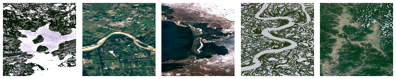

# Your Name in Landsat 

Welcome to the **Landsat Name Generator**! This is a fun and interactive React application that translates your name into stunning Landsat satellite imagery. Each letter is represented by a natural earth feature that resembles it, captured from space!

### [Live Demo](https://landsat.vercel.app)

---

## Preview



## Features

- **Satellite Imagery:** Converts any text into beautifully crafted satellite image letters.
- **Dynamic Variations:** Letters with multiple available images will randomize on generation, ensuring unique results.
- **Download Option:** Easily download your newly generated Landsat name as a `.png` file to share with friends!

## Tech Stack

- **Frontend Framework:** React 19 (via Vite)
- **Styling:** Vanilla CSS
- **Libraries:** 
  - `html2canvas` (for downloading the generated images)
  - `react-icons` (for UI icons)

## Getting Started

Follow these instructions to set up the project on your local machine.

### Prerequisites

Ensure you have Node.js and npm (or yarn/pnpm) installed.

### Installation

1. Clone the repository:
   ```bash
   git clone https://github.com/AlphaBeta07/web_technology.git
   ```
2. Navigate to the project directory:
   ```bash
   cd project/name
   ```
3. Install dependencies:
   ```bash
   npm install
   ```

### Running Locally

Start the development server:

```bash
npm run dev
```

Open your browser and navigate to the local server URL provided in the terminal (usually `http://localhost:5173/`) to view the application.
